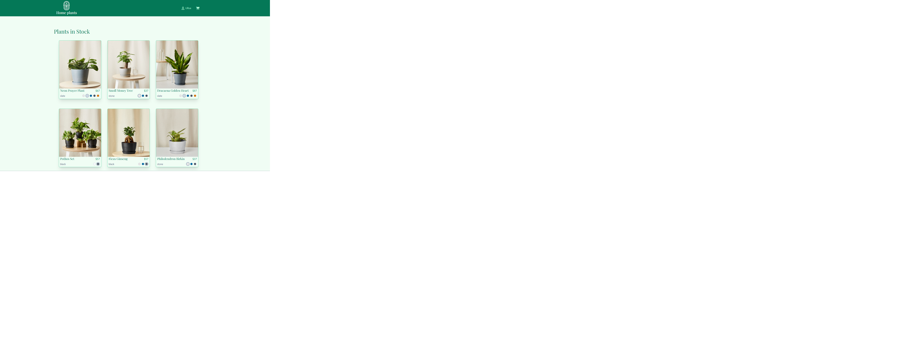
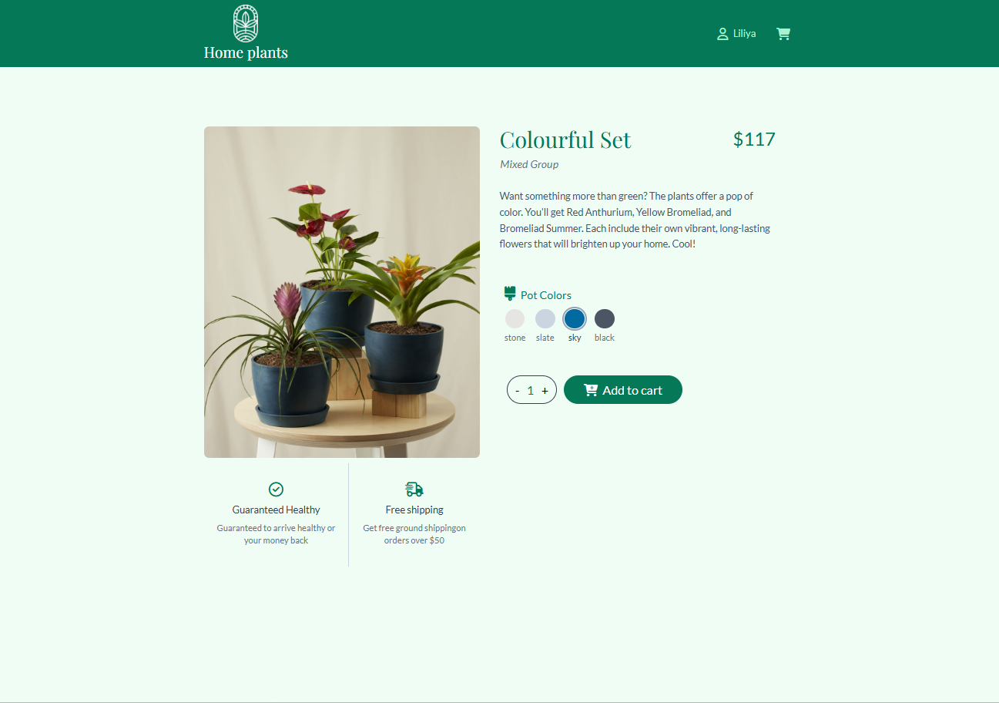
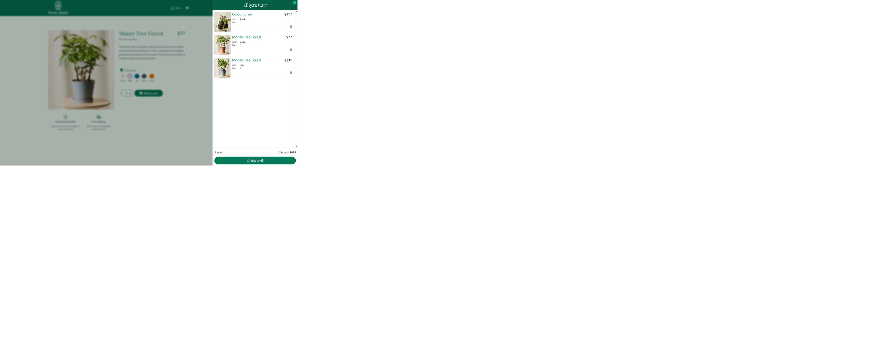

# 🌱 Flowers Shop - Plant E-Commerce Website

A modern plant e-commerce application built with React and Tailwind CSS that allows users to explore available plants, view detailed product information, customize selections, and manage their shopping cart!.

The application provides a smooth and interactive shopping experience with responsive design, animations, user authentication, and dynamic cart functionality.

### Plant List

### Plant Details

### Shopping Cart

## 🚀 Features

## 🔐 User Authentication

- Users can create a new account and sign in.
- Authentication is handled using JWT tokens.
- Registered users can access available plants currently in stock.
- Provides a personalized shopping experience.

## 🌿 Plant Catalog

- Browse available plants with a clean and modern interface.
- Display plants dynamically from the application data source.
- Smooth scrolling experience with interactive animations.
- Responsive design optimized for desktop, tablet, and mobile devices.

## 🌱 Plant Details Page

Users can view detailed information about each plant:

- Plant name and description
- Product images with zoom functionality
- Available pot colors
- Ability to select different product options
- Ability to choose quantity before adding to cart

## 🛒 Shopping Cart

Users can manage their shopping experience:

- Add multiple plants to the cart
- Add different quantities of the same plant
- View all selected products
- Display:
  - Total number of items
  - Cart subtotal price
  - Product details
- Remove items from the cart

# 🛠️ Technologies Used

## Front-End

- **React 19**
- **JavaScript (ES6+)**
- **Tailwind CSS**
- **Vite**
